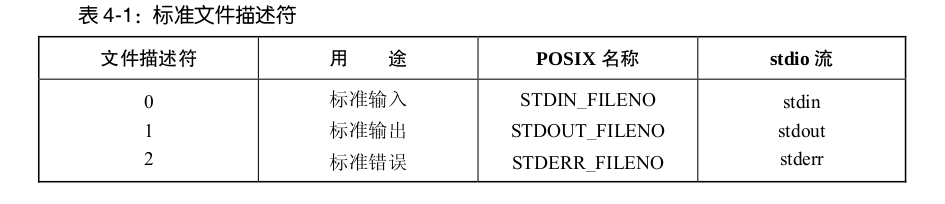

# Linux I/O
就本质而言,内核只提供一种文件类型:字节流序列

UNIX系统没有文件结束符的概念,读取文件时如无数据返回,便会认定抵达文件末尾。

I/O系统调用使用非负整数来指代打开的文件,称为文件描述符。

针对每个进程,文件描述符都自成一套。

由shell启动的进程会继承3个已打开的文件描述符:
+ 描述符0为标准输入,指代为进程提供输入的文件
+ 描述符1为标准输出,指代供进程写入输出的文件
+ 描述符2为标准错误,指代供进程写入错误消息或异常通告的文件。

在stdio函数库中,这几种描述符分别与文件流stdin、stdout和stderr相对应。


UNIX系统I/O模型最为显著的特性之一是其I/O通用性概念：
+ 同一套系统调用(open()、read()、write()、close()等)所执行的I/O 操作,可施之于所有文件类型,包括设备文件在内。
+ 应用程序发起的I/O请求,内核会将其转化为相应的文件系统操作,或者设备
驱动程序操作,以此来执行针对目标文件或设备的I/O操作。

## 通用I/O函数
### open()
open()调用既能打开一个已存在的文件,也能创建并打开一个新文件。
```
#include <sys/stat.h>
#include <fcntl.h>
int open(const char *pathname, int flags, .../*mode_t mode */);
```
+ pathname：要打开的文件，如果为符号链接，会对其进行解引用
+ flags：位掩码，用于指定文件的访问模式
系统调用的flags参数值介绍1.png)
系统调用的flags参数值介绍2.png)
+ mode：当调用open创建新文件时,位掩码参数mode指定了文件的访问权限。mode_t属于整数类型。
+ 返回值：成功返回文件描述符，出错返回-1并设置errno
SUSv3规定,如果调用open()成功,必须保证其返回值为进程未用文件描述符中数值最小者。

### creat()
creat()系统调用来创建并打开一个新文件。
```
#include <fcntl.h>
int creat(const char *pathname, mode_t mode);
```
+ pathname：要创建的文件名
+ 返回值：成功返回文件描述符，失败返回-1
若文件已存在,则打开文件,并清空文件内容,将其长度清0。

### read()
read()系统调用从文件描述符fd所指代的打开文件中读取数据。
```
#include <unistd.h>
ssize_t read(int fd, void *buffer, size_t count);
```
+ fd：要读取的文件的文件描述符
+ buffer：用来存放输入数据的内存缓冲区地址，缓冲区至少应有count个字节
+ count：最多能读取的字节数，size_t属于无符号整型
+ 返回值：成功返回实际读取的字节数,遇到文件结束(EOF)则返回0,出错则返回-1。ssize_t属于有符号的整数类型。
  
一次read()调用所读取的字节数可以小于请求的字节数。对于普通文件而言,这有可能是因为当前读取位置靠近文件尾部。

### write()
write()系统调用将数据写入一个已打开的文件中。
```
#include <unistd.h>
ssize_t write(int fd, void *buffer, size_t count);
```
+ fd：要写入文件的文件描述符
+ buffer：要写入文件中数据的内存地址
+ count：要从buffer写入文件爱你的数据字节
+ 返回值：成功返回实际写入文件的字节数,失败返回-1

返回值可能小于count参数值，这被称为“部分写”。对磁盘文件来说,造成“部分写”的原因可能是由于磁盘已满,或是因为进程资源对文件大小的限制。

对磁盘文件执行I/O操作时,write()调用成功并不能保证数据已经写入磁盘。因为为了减少磁盘活动量和加快write()系统调用,内核会缓存磁盘的I/O操作。

### close()
close()系统调用关闭一个打开的文件描述符,并将其释放回调用进程,供该进程继续使用。当一进程终止时,将自动关闭其已打开的所有文件描述符。
```
#include <unistd.h>
int close(int fd);
```
fd：已打开的文件描述符
返回值：成功返回0，出错返回-1

### lseek()
对于每个打开的文件,系统内核会记录其文件偏移量,有时也将文件偏移量称为读写偏移量或指针。文件偏移量是指执行下一个read()或write()操作的文件起始位置,会以相对于文件头部起始点的文件当前位置来表示。文件第一个字节的偏移量为0。

文件打开时,会将文件偏移量设置为指向文件开始,以后每次read()或write()调用将自动对其进行调整,以指向已读或已写数据后的下一字节。

针对文件描述符fd参数所指代的已打开文件,lseek()系统调用依照offset 和 whence 参数值调整该文件的偏移量。
```
#include <unistd.h>
off_t lseek(int fd, off_t offset, int whence);
```
+ fd：要操作的文件描述符
+ offset：以字节为单位的数值
+ whence：表示参照哪个基点来解释offset参数
    - SEEK_SET：将文件偏移量设置为从文件头部起始点开始的 offset 个字节。
    - SEEK_CUR：相对于当前文件偏移量,将文件偏移量调整 offset 个字节 。
    - SEEK_END：将文件偏移量设置为起始于文件尾部的 offset 个字节。
函数中whence参数.png)
+ 返回值：成功返回新的文件偏移量，出错返回-1

如果whence参数值为SEEK_CUR或SEEK_END,offset参数可以为正数也可以为负数;如果whence参数值为SEEK_SET,offset参数值必须为非负数。

lseek()调用只是调整内核中与文件描述符相关的文件偏移量记录,并没有引起对任何物理设备的访问。

如果程序的文件偏移量已然跨越了文件结尾,然后再执行I/O操作,read()调用将返回0,表示文件结尾。write()函数可以在文件结尾后的任意位置写入数据。

从文件结尾后到新写入数据间的这段空间被称为文件空洞。从编程角度看,文件空洞中是存在字节的,读取空洞将返回以0(空字节)填充的缓冲区。然而,文件空洞不占用任何磁盘空间。直到后续某个时点,在文件空洞中写入了数据,文件系统才会为之分配磁盘块。

文件空洞的主要优势在于,与为实际需要的空字节分配磁盘块相比,稀疏填充的文件会占用较少的磁盘空间。核心转储文件(core dump)是包含空洞文件的常见例子。

空洞的存在意味着一个文件名义上的大小可能要比其占用的磁盘存储总量要大。向文件空洞中写入字节,内核需要为其分配存储单元,即使文件大小不变,系统的可用磁盘空间也将减少。

### ioctl()
```
#include <sys/ioctl.h>
int ioctl(int fd, int request, .../* argp */);
```
+ fd：某个设备或文件已打开的文件描述符
+ request：将在fd上执行的控制操作。具体设备的头文件定义了可传递给 request参数的常量。
+ ...：第三个参数采用了标准C语言的省略符号(...)来表示(称为argp),可以是任意数据类型。ioctl()根据request的参数值来确定 argp 所期望的类型。
+ 返回值：成功返回0，出错返回-1 

### fcntl()
fcntl()系统调用对一个打开的文件描述符执行一系列控制操作。
```
#include <fcntl.h>
int fcntl(int fd, int cmd, ...);
```
+ fd：要操作的文件描述符
+ cmd：cmd参数所支持的操作范围很广
+ ...：内核会依据cmd参数的值来确定该参数的数据类型
+ 返回值：成功返回0，出错返回-1

所有系统调用都是以原子操作方式执行的。内核保证了某系统调用中的所有步骤会作为独立操作而一次性加以执行,其间不会为其他进程或线程所中断。

竞争状态是这样一种情形:操作共享资源的两个进程(或线程),其结果取决于一个无法预期的顺序,即这些进程获得CPU使用权的先后相对顺序。

